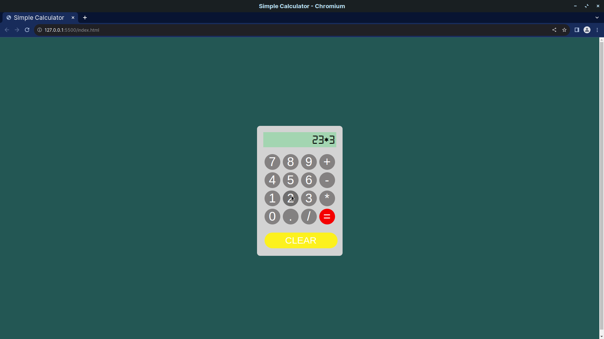

# Simple Calculator App

This web app is made with the help of simple *Vanilla JavaScript*.

This idea is not mine. I made this app seeing a [video tutorial](https://www.youtube.com/watch?v=8IxIyI3JomE) by [Ania Kubow](https://www.youtube.com/@AniaKubow).

 
 

## This is how it looks like :point_down:

 

    

---